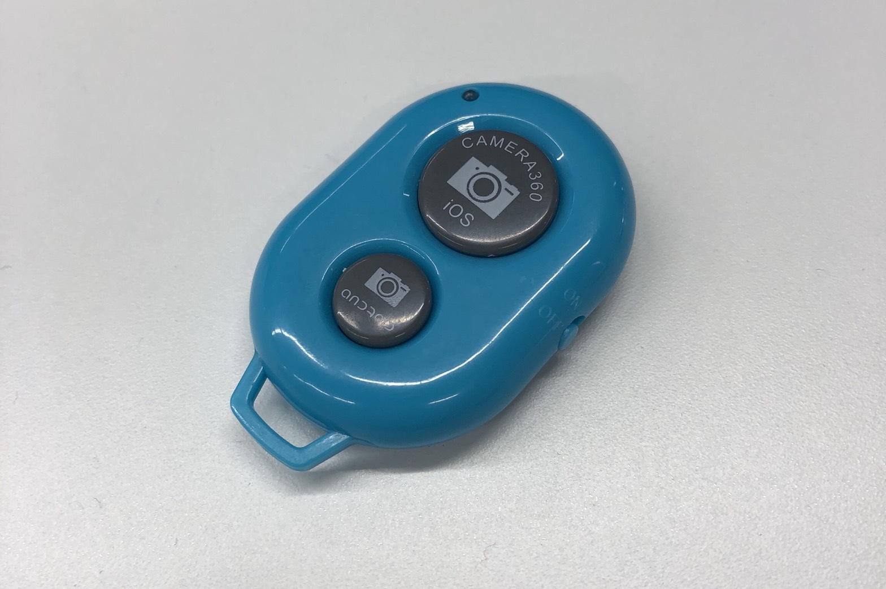
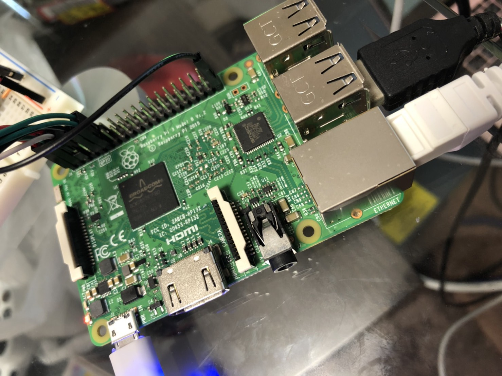
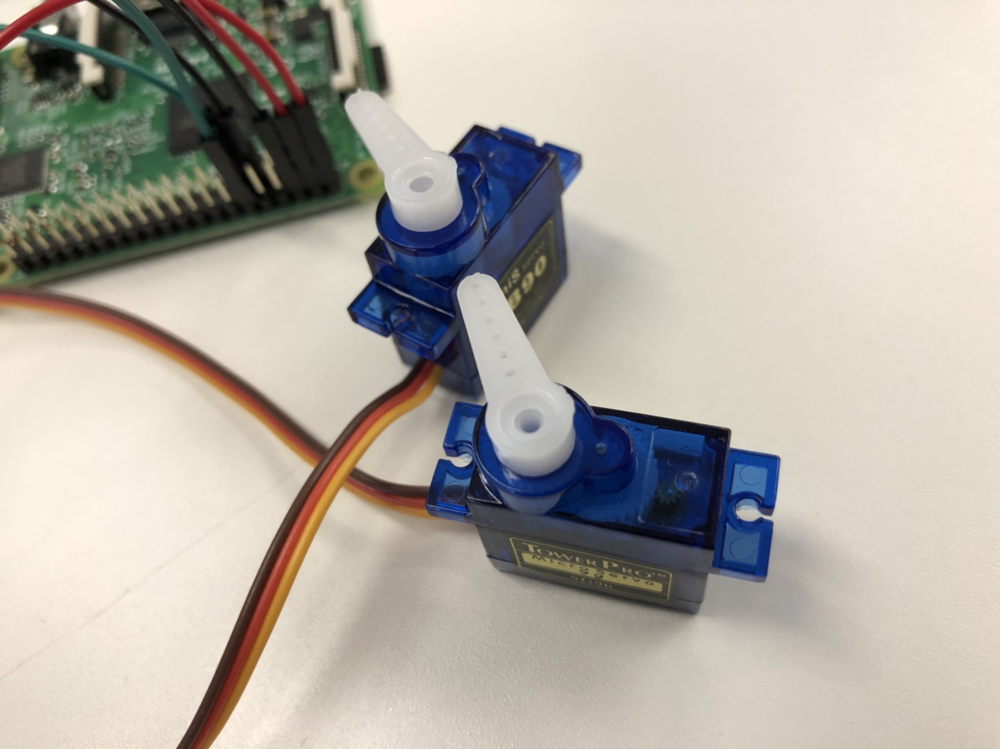
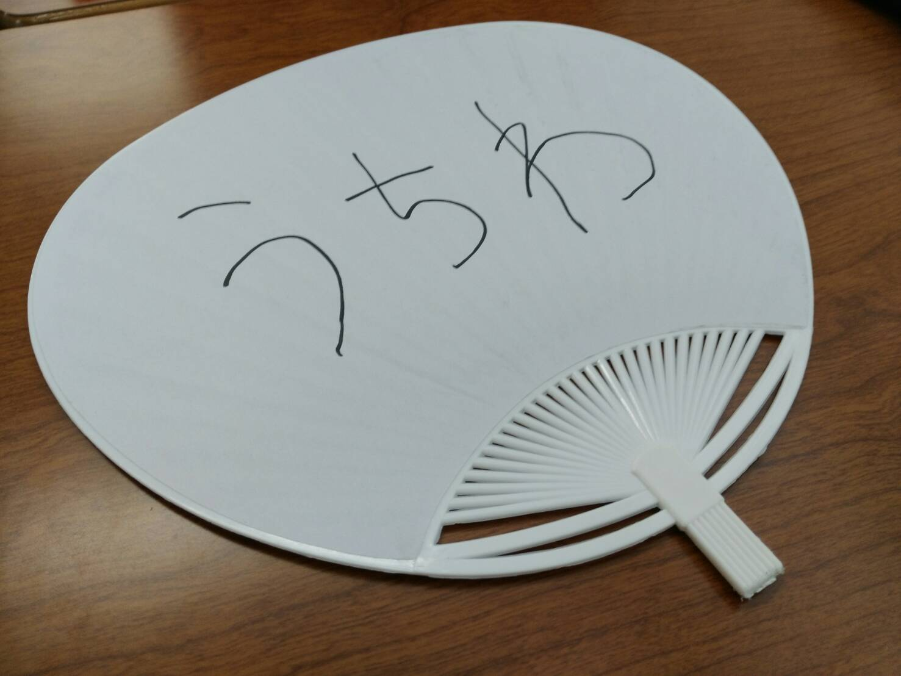

# Winds Servo 2018 Summer Edition


Bluetoothボタンを押すとラズパイに取り付けたうちわが動作し, 涼しい気持ちになれます&#x1f300;

// TODO: gif

短く押すとうちわが扇ぎ, 長く押すとうちわの方向転換を行います.

## 必要なもの

ダイソーで300円で購入したBluetoothリモートシャッター



SSH接続が可能なRaspberry Pi



サーボモーター２つ



柄の部分を切断したうちわ



## ファイル構成

|ファイル名|説明|
|:--|:--|
|bluebutton|bluebuttonの設定ファイル|
|direction.example|うちわの方向転換用サーボの動作角度記録用ファイル|
|uchiwa_angle.py|うちわの首振り用サーボの制御コード|
|uchiwa_direction.py|うちわの方向転換用サーボの制御コード|

## ハードウェア側の設定

// TODO: 書く

### サーボと土台の接合

### サーボとサーボの接合

### サーボとうちわの接合

## ソフトウェア側の設定

### SSH接続

```bash
$ ssh pi@raspberrypi.local
pi@raspberrypi.local's password:
...
pi@raspberrypi:~ $
```

### Bluetoothを扱うために必要なパッケージをインストール(初回のみ)

```bash
$ sudo apt-get install bluez bluetooth libbluetooth-dev build-essential
```

### ボタン操作の検知に必要なパッケージをインストール(初回のみ)

```bash
$ sudo apt-get install ruby
$ sudo gem install bluebutton
```

### リポジトリのクローン(初回のみ)

```
$ git clone https://github.com/tyokinuhata/uchiwa.git
$ cd uchiwa
```

### サーボの設定(初回のみ)

```bash
$ cp ./src/direction.example ./src/direction
```

### Bluetoothのペアリング

Bluetoothリモートシャッターの電源を入れ, コンソールで以下のコマンドを叩く.

```bash
$ bluetoothctl
[bluetooth]# power on                  // bluetoothctlを起動
[bluetooth]# scan on                   // スキャンを開始
...
Device FF:FF:XX:XX:XX:XX AB Shutter3
...
[bluetooth]# info FF:FF:XX:XX:XX:XX    // Shutter3の情報を表示
[bluetooth]# pair FF:FF:XX:XX:XX:XX    // Shutter3とペアリング
```

### bluebuttonの実行

```bash
$ bluebutton -d="Shutter3" -c ./bluebutton
```

bluebuttonの実行後, Bluetoothリモートシャッターのボタンを押すと設定ファイルの対応した処理が走る.
